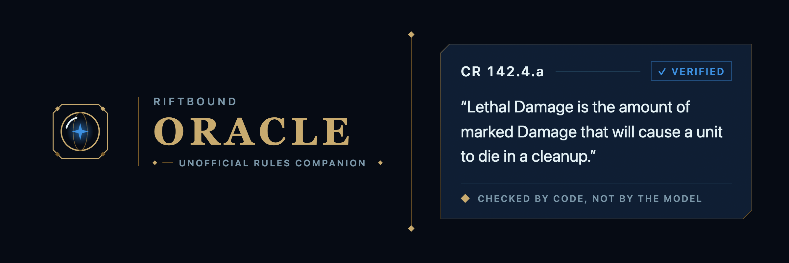
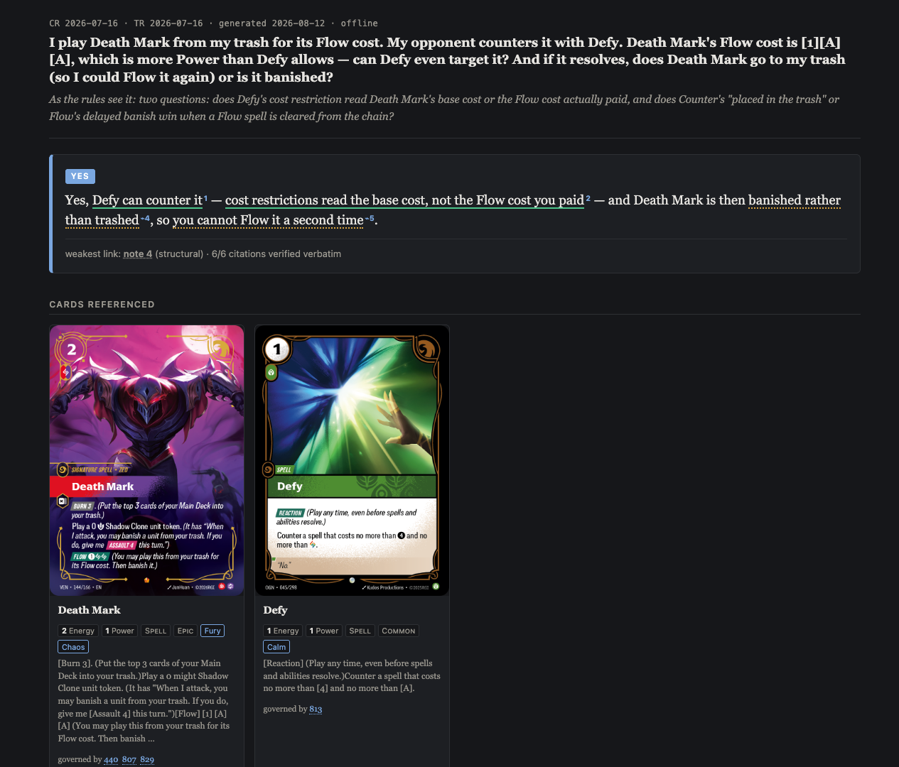
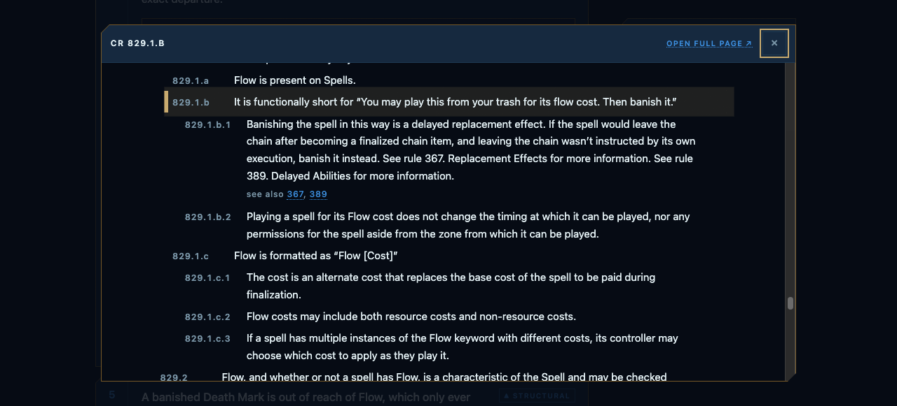

<p align="center">
  
</p>

# Riftbound Oracle

**An agent skill that answers Riftbound TCG rules questions with citations you can
actually check.**

Ask your AI agent a rules question. Get back an interactive report: a one-line verdict,
the reasoning broken into individually-graded claims, and every citation expandable to
the real rule text — with a link straight into the rulebook.

Before the report is written, a deterministic verifier proves that every cited rule
exists and that every quote appears verbatim. **A citation that fails cannot reach you.**

Runs entirely on your machine, on whatever agent you already use. Install by copying one
folder — no build step, no API key, and no network needed to install or to answer. (Card
artwork in a report loads from Riot's CDN; offline it shows a placeholder and everything
else still works.)



---

## Install

```bash
git clone https://github.com/gear-null/riftbound-oracle /tmp/riftbound-oracle
mkdir -p .claude/skills
cp -R /tmp/riftbound-oracle/.claude/skills/rules-report .claude/skills/
```

That's it. **Requires Python 3.9+** and an agent that can run shell commands and read
files (Claude Code, or anything with equivalent tool access).

Check it works:

```bash
cd .claude/skills/rules-report/lib
python3 rules_cli.py selftest
```

## Ask it something

In Claude Code the skill is picked up automatically — just ask:

```
Does a countered Flow spell still get banished?
```

```
Unchecked Power deals 12 damage to all units at battlefields. Player 2 has
Viktor, Leader and two Vanguard Sergeants. How many Recruits do they play?
```

The agent looks up any named cards exactly, navigates the rulebook, writes a structured
answer, verifies it, and opens the report. **You never run a command yourself.**

---

## Why it's different

**It cites rules, not vibes.** Every Riftbound rule has a canonical address like
`471.1.b.1`, so the system cites addresses and then checks them mechanically. For
comparison, in 7,774 community-written answers to real questions, **29% of rule
citations point at an ID that doesn't exist.**

**It refuses.** When the rules don't settle something, it says `UNSETTLED` and names the
gap rather than reaching for a plausible answer. Abstention is held to the same standard
as assertion: a claim that the rules are silent has to show what it searched.

**Confidence is a floor, not an average.** Nine solid claims plus one inference makes an
inferred answer, and the report says so. You always know the weakest step.

**You can follow every citation.** Clicking a rule opens the full anchored rulebook over
the report — scrolled to the exact clause, with its own cross-references live, without
losing your place.



---

## Using a different agent

Nothing here is Claude-specific. `SKILL.md` is plain markdown describing a procedure,
and the tools are ordinary CLI programs. Give your agent `SKILL.md` as instructions and
shell access to `lib/`.

The parts that must not be improvised — does this rule exist, does it say this verbatim,
which rule is the tightest one that says it — are enforced by code, not by the model's
good intentions. If an agent produces an answer whose citations fail, the report refuses
to render. That is the intended behaviour.

### The tools your agent uses

| command | what it does |
|---|---|
| `rules_cli.py card <name>` | Exact card lookup → printed text, stats, keywords, mapped rule sections |
| `rules_cli.py rule <id>` | A rule **with its ancestor spine**, children, examples, cross-refs |
| `rules_cli.py section <id>` | A whole numbered section in document order |
| `rules_cli.py grep <query>` | Lexical search (SQLite FTS5 syntax) |
| `rules_cli.py report <json>` | **Verify + render + open.** How an answer is finished |
| `rules_cli.py selftest` | Regression harness; run after every rules update |

---

## Documentation

| | |
|---|---|
| [How to read a report](docs/report-anatomy.md) | What the grades, superscripts and legend mean |
| [Maintaining the skill](docs/maintaining.md) | Refreshing the corpus after a Riot update |
| [Decision records](docs/README.md#decision-records) | Why it's built this way, and what was measured |
| [Content and licensing](docs/content-and-licensing.md) | What's committed, and what is deliberately not |

Riftbound is a trademark of Riot Games. This project is **unofficial and not endorsed by
Riot**. No card artwork ships in the corpus — reports load it from Riot's CDN.
